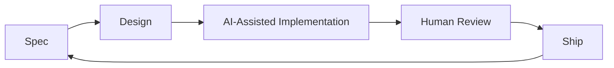

# Loumonth Jack Jr ⚡

> **Software Engineer** | Building the future with AI-augmented development

```
┌──────────────────────────────────────────────────────────────┐
│  🧠 Human Intelligence  ←→  🤖 AI Collaboration  ←→  🚀 Ship │
└──────────────────────────────────────────────────────────────┘
```

## 🌐 Connect

[](https://loumonthjack.com)
[](mailto:me@loumonthjack.com)
[](https://linkedin.com/in/loumonth-jack-jr)
[]()

---

## 🤖 AI-Augmented Development Stack

I leverage cutting-edge AI tools to accelerate development while maintaining code quality and architectural integrity.

| Tool | Purpose |
|------|---------|
| **Kiro** | Spec-driven development with AI steering |
| **Claude** | Pair programming, code review, architecture design |
| **Cursor** | Inline completions, AI-native code editing |
| **Antigravity** | Browser review and agent manager |
| **Lovable** | Rapid UI prototyping |

### Development Philosophy



**Spec-Driven Development** — I use structured specifications to guide AI agents, ensuring consistent, well-documented, and maintainable code. Every feature starts with requirements, evolves through design, and executes via task-driven implementation.

---

## 🛠 Technical Arsenal

### Languages & Runtimes
```
TypeScript  ████████████████████  95%
Go          ████████████████░░░░  80%
SQL         ███████████████░░░░░  75%
Python      ██████████████░░░░░░  70%
```

### Core Stack
- **Frontend**: React, Vue.js, TailwindCSS
- **Backend**: Node.js, Express, Go, GraphQL (Apollo)
- **Data**: PostgreSQL, MongoDB, DynamoDB, Redis
- **Cloud**: AWS, Cloudflare
- **DevOps**: Docker, GitHub Actions, Terraform

### Architecture Patterns
- Event-Driven Systems
- Microservices & Serverless
- Modular Monoliths

---

## 🔭 Featured Projects

### 📨 Event-Driven Communication Service
Full-stack system for email/SMS template management with React editor, version history, and 2FA security.
`TypeScript` `React` `Node.js` `PostgreSQL` `Temporal`

### 🔐 Distributed Secrets Manager
Internal encryption tool for decentralized key management across microservices.
`Microservices` `AES-256` `HashiCorp Vault Pattern`

### 🚀 Dynamic Onboarding Framework
Flexible system with dynamic form generation, role management, and real-time validation.
`React` `GraphQL` `PostgreSQL`

---

## 🧪 Currently Exploring

- **AI Agent Orchestration** — Building autonomous development workflows
- **LLM-Powered Code Review** — Automated PR analysis and suggestions
- **Spec-Driven AI Development** — Using Kiro for structured feature development
- **Edge Computing** — Cloudflare Workers, Deno Deploy

---

## 💬 Let's Build Together

I'm passionate about:
- 🏗️ Scalable architectures that handle millions of operations
- 🔒 Security-first development practices
- 🤖 AI-augmented development workflows
- 📐 Clean, maintainable, well-documented code

**Open to collaborations** on projects pushing the boundaries of what's possible with AI-assisted and AI-agentic development.

---

<p align="center">
  <i>"The best code is the code that writes itself — with a little help from AI."</i>
</p>

<p align="center">
  
</p>
